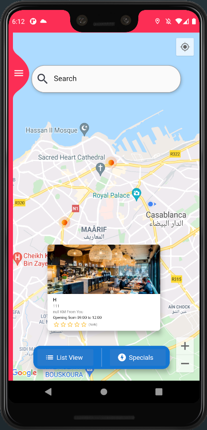
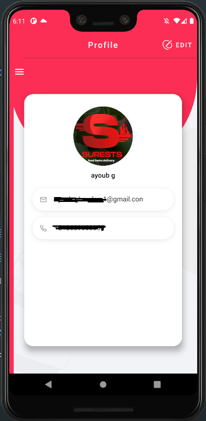

# 🔥🔥 Resto reservation  App.

Star⭐ the repo if you like what you see😉.

## ✨ Requirements
* Any Operating System (ie. MacOS X, Linux, Windows)
* Any IDE with Flutter SDK installed (ie. IntelliJ, Android Studio, VSCode etc)
* A little knowledge of Dart and Flutter
* A brain to think 🤓🤓

## Screenshots

    
    
  
    
 
 
  
   
    
    
    

 ## Design
Designe provided by the client 
<h2 id="license">License</h2>

<pre><code>  Copyright 2021  AyoubGHOUDAN
           
              Licensed under the Apache License, Version 2.0 (the "License");
              you may not use this file except in compliance with the License.
              You may obtain a copy of the License at
           
                  http://www.apache.org/licenses/LICENSE-2.0
           
              Unless required by applicable law or agreed to in writing, software
              distributed under the License is distributed on an "AS IS" BASIS,
              WITHOUT WARRANTIES OR CONDITIONS OF ANY KIND, either express or implied.
              See the License for the specific language governing permissions and
              limitations under the License.
</code></pre>

## 🤓 Author(s)
**Ayoub Ghoudan
 
