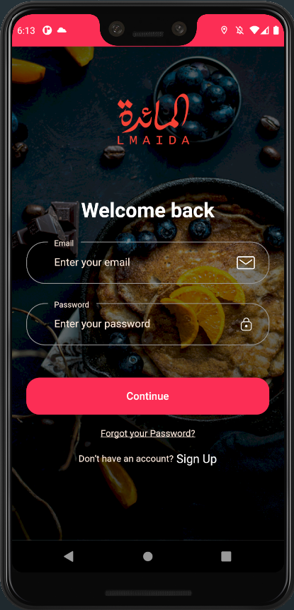
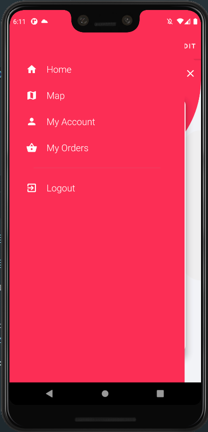

# 🔥🔥 Resto reservation  App.

Star⭐ the repo if you like what you see😉.

## ✨ Requirements
* Any Operating System (ie. MacOS X, Linux, Windows)
* Any IDE with Flutter SDK installed (ie. IntelliJ, Android Studio, VSCode etc)
* A little knowledge of Dart and Flutter
* A brain to think 🤓🤓


## Screenshots
<p>
    
    
  
    
 
 
  
   
    
    
    
</p>


## Installation

#### 1. [Setup Flutter](https://flutter.dev/docs/get-started/install)

#### 2. Clone the repo

#### 3. Setup the firebase app

- You'll need to create a Firebase instance. Follow the instructions at https://console.firebase.google.com.
- Once your Firebase instance is created, you'll need to enable Google authentication.

* Go to the Firebase Console for your new instance.
* Click "Authentication" in the left-hand menu
* Click the "sign-in method" tabZzz
* enable "Email and Password"
* enable "google Auth"
* Create an app within your Firebase instance for Android, with package name com.<yourCompany>.app
* Run the following command to get your SHA-1 key:

```
keytool -exportcert -list -v \
-alias androiddebugkey -keystore ~/.android/debug.keystore
```

* In the Firebase console, in the settings of your Android app, add your SHA-1 key by clicking "Add Fingerprint".
* Follow instructions to download google-services.json
* place `google-services.json` into `/android/app/`.

- (skip if not running on iOS)

* Create an app within your Firebase instance for iOS, with your app package name
* Follow instructions to download GoogleService-Info.plist
* Open XCode, right click the Runner folder, select the "Add Files to 'Runner'" menu, and select the GoogleService-Info.plist file to add it to /ios/Runner in XCode
* Open /ios/Runner/Info.plist in a text editor. Locate the CFBundleURLSchemes key. The second item in the array value of this key is specific to the Firebase instance. Replace it with the value for REVERSED_CLIENT_ID from GoogleService-Info.plist

Double check install instructions for both
   - Google Auth Plugin
     - https://pub.dartlang.org/packages/firebase_auth
   - Firestore Plugin
     -  https://pub.dartlang.org/packages/cloud_firestore

 ## Design
Designe provided by the client 
<h2 id="license">License</h2>

<pre><code>  Copyright 2021  AyoubGHOUDAN
           
              Licensed under the Apache License, Version 2.0 (the "License");
              you may not use this file except in compliance with the License.
              You may obtain a copy of the License at
           
                  http://www.apache.org/licenses/LICENSE-2.0
           
              Unless required by applicable law or agreed to in writing, software
              distributed under the License is distributed on an "AS IS" BASIS,
              WITHOUT WARRANTIES OR CONDITIONS OF ANY KIND, either express or implied.
              See the License for the specific language governing permissions and
              limitations under the License.
</code></pre>

## 🤓 Author(s)
**Ayoub Ghoudan
 
